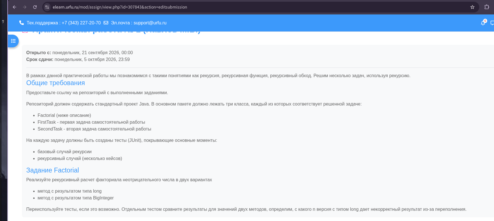
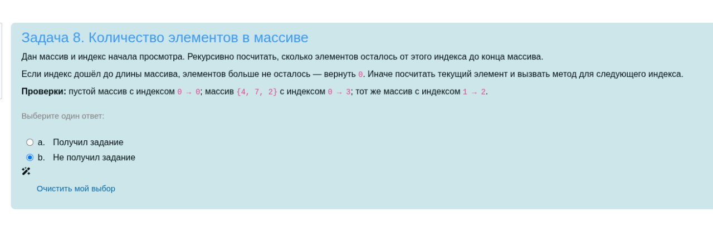
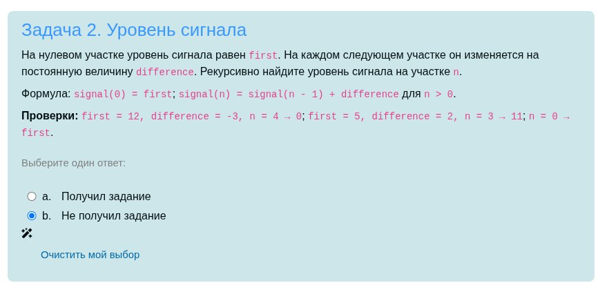
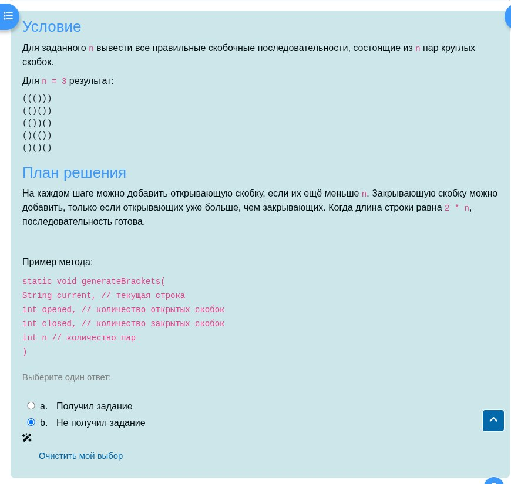

# Лабораторная работа №1

## Запуск

```bash
cd labs/algorithms/lab-01-algorithms
mvn clean test
```

## Скачать одну папку

```bash
git clone --filter=blob:none --no-checkout https://github.com/axstiz/Java-learning.git
cd Java-learning
git sparse-checkout init --no-cone
git sparse-checkout set '/labs/algorithms/lab-01-algorithms/'
git checkout main
```

## Задания

### FactorialTask



### FirstTask



### SecondTask



### ThirdTask

