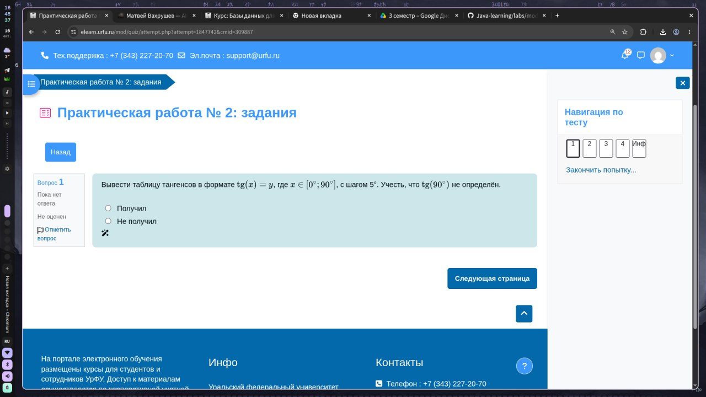
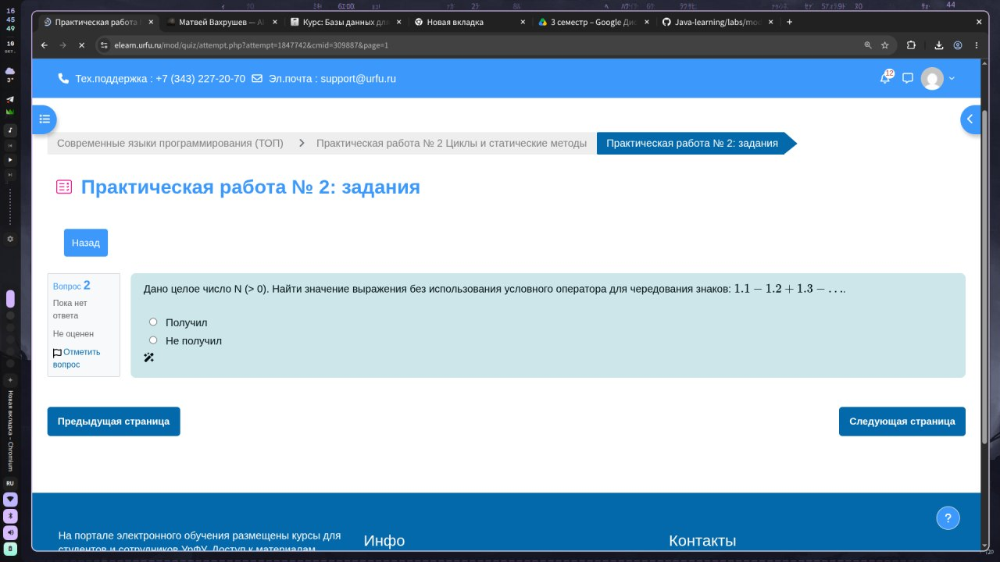
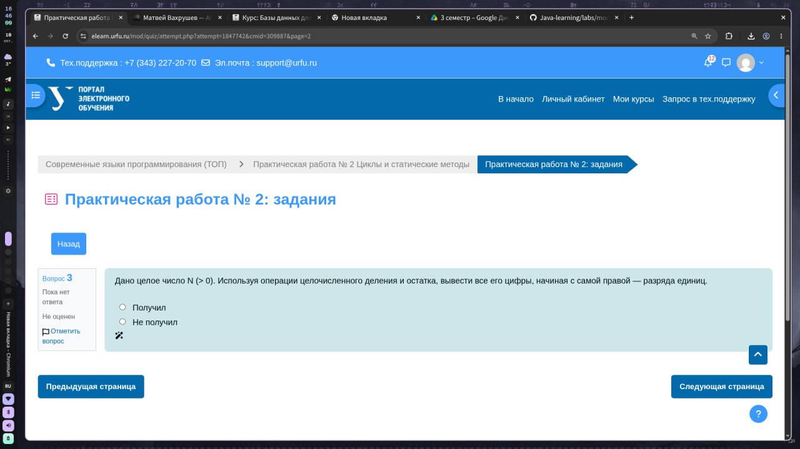
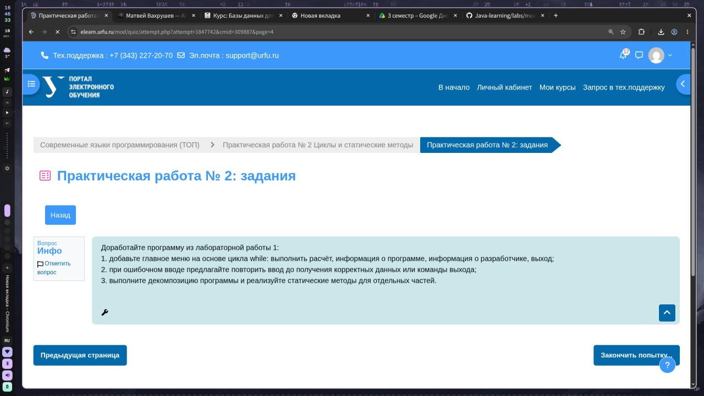

# Современные ЯП Лабораторная работа №2

## Скачать одну папку

```bash
git clone --filter=blob:none --no-checkout https://github.com/axstiz/Java-learning.git
cd Java-learning
git sparse-checkout init --no-cone
git sparse-checkout set '/labs/modern-lang/lab-02-langs/'
git checkout main
```

## Задания

### First.java



### Second.java



### Third.java



### Fourth.java


### lab1updated/ (рефактор ЛР №1)


